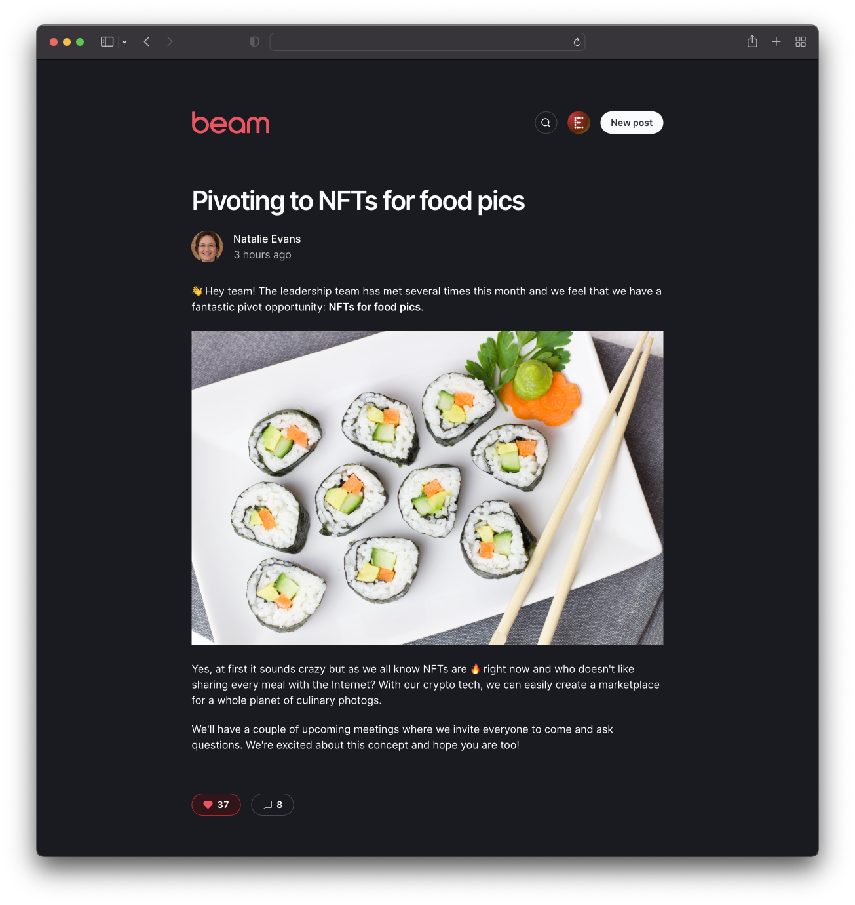

Beam is a simple tool that allows members to write posts to share across your
organization. Think of it like a lightweight internal blog. Features include a
simple **Markdown-based** editor with preview, **image drag and drop**, comments
and likes, **search**, a clean responsive layout with **dark mode support**, and
an admin role for hiding posts.

This is a proud fork of the original [Beam](https://github.com/planetscale/beam)



## Setup

### Install dependencies

```bash
bun i
```

### Create a database

- [Create a PlanetScale database](https://planetscale.com/docs/tutorials/planetscale-quick-start-guide#create-a-database)
- Create a
  [connection string](https://planetscale.com/docs/concepts/connection-strings#creating-a-password)
  to connect to your database. Choose **Prisma** for the format
- **Alternatively**, your PlanetScale database and connection string can be
  generated using the [pscale CLI](https://github.com/planetscale/cli) or GitHub
  Actions. [View instructions](doc/pscale-actions-setup.md).
- Set up the environment variables:

```bash
cp .env.example .env
```

- Open `.env` and set the `DATABASE_URL` variable with the connection string
  from PlanetScale
- Create the database schema:

```bash
bun db:push
```

### Configure authentication

At manifold, we just use github. Open to PR's that expand this.

- [Configuring GitHub authentication](doc/github_setup.md)

Beam uses [Lucia](https://lucia-auth.com/), so if you prefer to use something
else, feel free to make a PR.

### Enable image uploads 

Currently manditory, but we are welcome to PR's making it optional.

Beam uses Uploadthing for storing uploaded images. You can
[sign up for a free account](https://uploadthing.com/).

- On your uploadthing dashboard, look for these values under your account
  settings:**API Key**, **API Secret**.
- Update `.env` with the api keys

## Running the app locally

```bash
bun dev
```

Open [http://localhost:3000](http://localhost:3000) in your browser.
